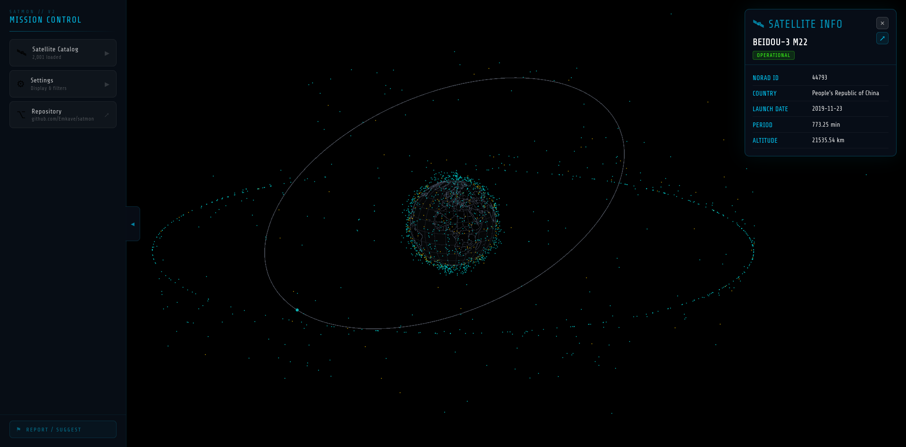
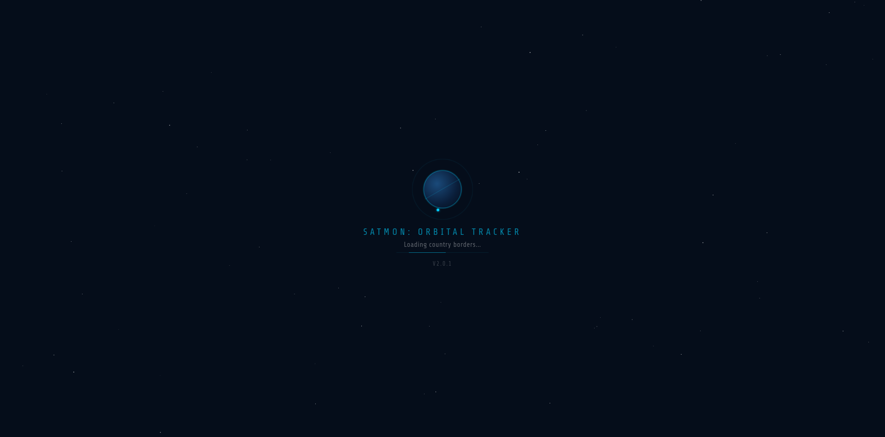
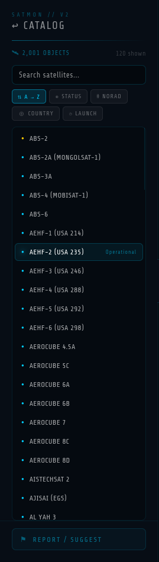
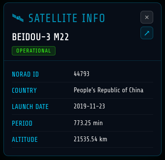
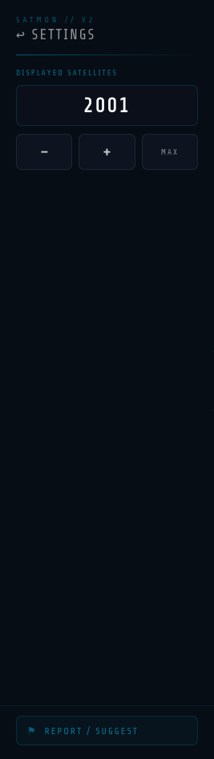
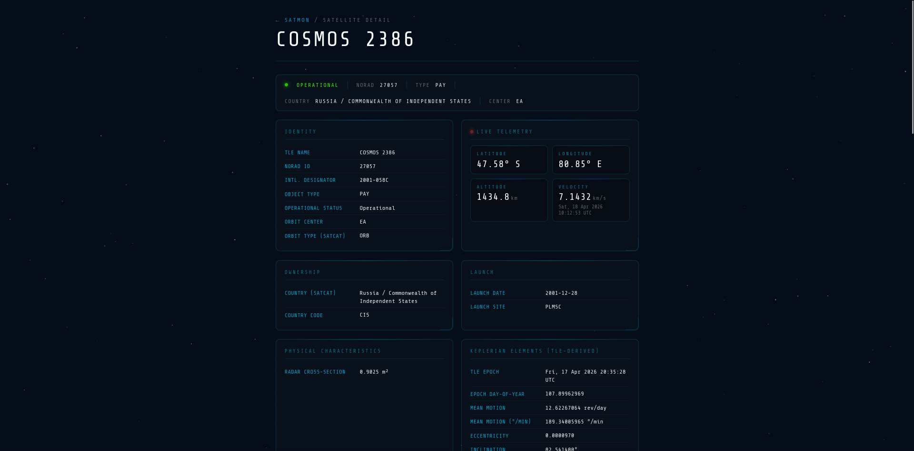
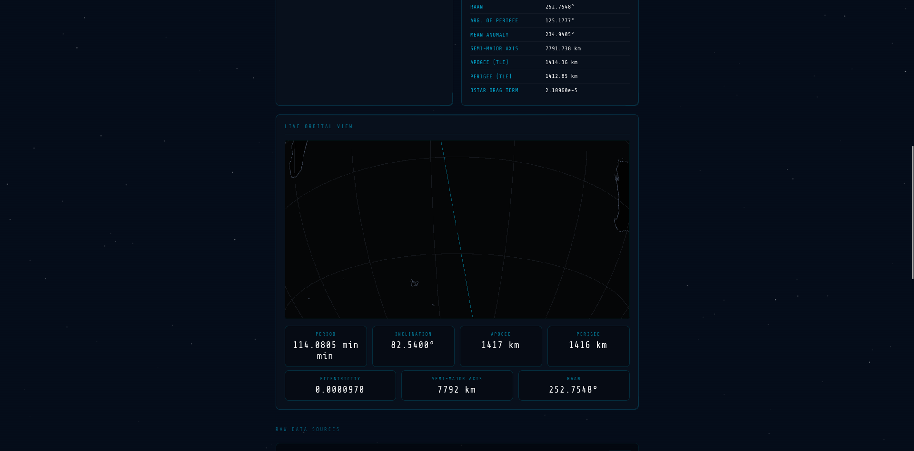
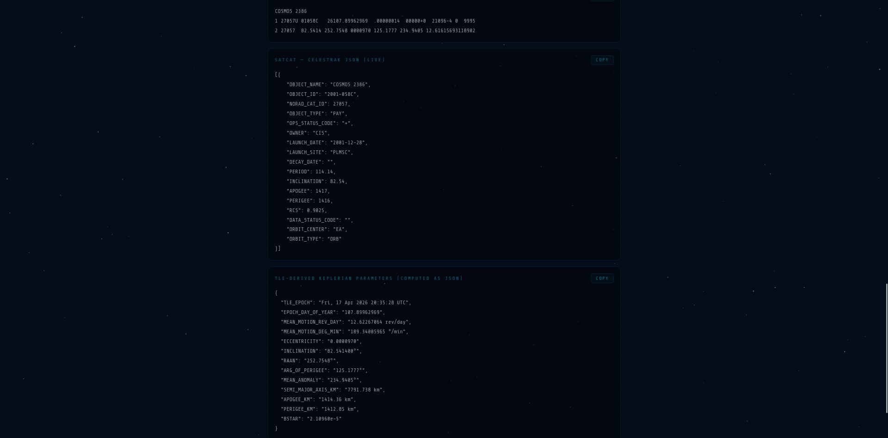

# Satmon — Orbital Tracker

> Real-time satellite tracking on an interactive 3D globe, powered by live TLE data.



---

## Overview

Satmon is a browser-based satellite tracking application that renders thousands of active and historical orbital objects in real time on a CesiumJS globe. It pulls live Two-Line Element (TLE) data, cross-references it against two authoritative satellite databases, and lets you explore, search, and inspect any object in the catalog.

**Key capabilities:**

- Live propagation of up to several thousand satellite positions simultaneously, updated every millisecond via a dedicated Web Worker
- Interactive 3D globe with custom land/ocean styling, country borders, lat/lon graticule, and country labels
- Per-satellite orbital path animation drawn directly onto the globe
- Sidebar catalog with full-text search and multi-column sorting
- Detailed info panel with live altitude, velocity, and Keplerian parameters
- Expandable full detail page for every satellite, generated from merged metadata
- In-app feedback submission (filed directly as GitHub Issues)

---

## Screenshots



*Loading screen — shown while globe tiles, borders, and TLE data are fetched and rendered.*



*Satellite catalog — searchable and sortable list of all loaded objects. Color-coded by operational status.*



*Selected satellite — orbit path animates onto the globe; the info panel slides in from the right.*



*Settings — adjustable satellite count with hold-to-repeat increment/decrement controls.*



*Detail page — all available metadata for a single satellite, opened in a new browser tab.*

---

## Data Sources

| Source | What it provides |
|---|---|
| [Celestrak TLE feed](https://raw.githubusercontent.com/Emkave/satmon/main/public/tle.txt) | Two-line orbital elements for all tracked objects |
| [Celestrak SATCAT](https://celestrak.org/pub/satcat.csv) | Official satellite catalog: NORAD IDs, object types, operational status, launch/decay dates, orbit parameters |
| [UCS Satellite Database](https://raw.githubusercontent.com/Emkave/satmon/main/public/UCS_Satellite_Database.csv) | Enriched metadata: owner, purpose, manufacturer, launch vehicle, mass, power, lifetime |

All three sources are fetched at startup and merged by NORAD ID. The merged record is what populates both the sidebar info panel and the full detail page.

---

## Architecture

```
App.js
├── Globe.js              — CesiumJS viewer, custom styling, graticule, country labels
│   └── Satellite.js      — TLE fetch, SATCAT/UCS fetch, merge, propagation Worker, rendering
│       ├── (Web Worker)  — satellite.js propagation loop, runs off main thread
│       └── computeOrbitPositions() — on-demand orbit path for selected satellite
├── Sidebar.js            — Slide-out panel: catalog, settings, feedback modal
├── Satelliteinfopanel.js — Fly-in info card for the selected satellite
├── Loadingscreen.js      — Animated overlay during initial load
└── VersionBadge.js       — Fixed version stamp in the bottom-left corner
```

### Propagation pipeline

1. TLE text is parsed into `satrec` objects on the main thread using `satellite.js`.
2. All `satrec` objects are transferred to a Web Worker at startup.
3. The Worker runs `satellite.propagate()` for every object, converts ECI → geodetic, and packs the results into a `Float64Array`.
4. The buffer is transferred (zero-copy) back to the main thread, which updates `PointPrimitive` positions in the `PointPrimitiveCollection`.
5. The buffer is transferred back to the Worker for the next tick.

This keeps the main thread free and allows sub-millisecond update intervals without frame drops.

---

## Satellite Status Colors

| Color | Code | Meaning |
|---|---|---|
| Cyan `#00cfff` | `+` / *(empty)* | Operational |
| Yellow `#ffcc00` | `P`, `B`, `S`, `X`, `?` | Partial / standby / spare / extended / unknown |
| Red `#ff4455` | `D` | Decayed |

---

## Getting Started

### Prerequisites

- Node.js 18+
- A [Cesium Ion](https://ion.cesium.com/) access token (free tier works)

### Environment variables

Create a `.env` file in the project root:

```env
REACT_APP_CESIUM_TOKEN=your_cesium_ion_token_here

# Optional — only needed if you want the in-app feedback button to work
REACT_APP_GITHUB_FEEDBACK_TOKEN=your_github_pat_here
REACT_APP_GITHUB_OWNER=your_github_username
REACT_APP_GITHUB_REPO=your_repo_name
```

### Install and run

```bash
npm install
npm start
```

The app is served at `http://localhost:3000` by default.

### Build for production

```bash
npm run build
```

The compiled output lands in `build/`. The app is configured to be hosted at the `/satmon/` subpath — adjust `homepage` in `package.json` if you are deploying to a different path.


---

## Controls

| Action | Input |
|---|---|
| Rotate globe | Left mouse drag |
| Tilt | Right mouse drag or two-finger drag |
| Zoom | Scroll wheel |
| Select satellite | Left click on any dot |
| Deselect / close panel | Click the × button or click empty space |
| Fly to satellite | Click a row in the Satellite Catalog |
| Open full detail page | Click the ↗ button in the info panel |

---

## Dependencies

| Package | Purpose |
|---|---|
| `cesium` | 3D globe rendering engine |
| `satellite.js` | SGP4/SDP4 TLE propagation |
| `react` | UI component framework |

The propagation Worker imports `satellite.js` via CDN (`jsdelivr`) so it does not need to be bundled into the Worker blob separately.

---

## Project Structure

```
public/
  tle.txt                  — Cached TLE snapshot (updated separately)
  UCS_Satellite_Database.csv — Cached UCS database snapshot
  version.txt              — Current version string, read at runtime
  info.html                — Standalone satellite detail page
  cesium/                  — CesiumJS static assets
src/
  components/
    App.js
    Globe.js
    Satellite.js
    Sidebar.js
    Satelliteinfopanel.js
    Loadingscreen.js
    VersionBadge.js
    FeedbackWorker.js
```

---